<!-- Sección portada del repositorio -->
<a href="#">
    
</a>

<!-- Título del Repositorio -->
<br/>
<br/>
<p>
    <h1 align="center">
        <strong>Tutorial de Machine Learning y su aplicación en tiempo real (Aún en Desarrollo)</strong>
    </h1>
    <strong>Elaborado por: </strong>
    <a href="https://github.com/metantonio">Antonio Martínez (Metantonio)</a>
</p>

<!-- Explicación del Repositorio -->

Este repositorio estará basado en la explicación paso a paso en el uso de TensorFlow, Google Colab, y Python en los entrenamientos de Machine Learning para luego usar a través de HTML y JSON los modelos aprendidos por una red neuronal.

# [VERSIÓN ONLINE](https://metantonio-tensorflow-web.vercel.app/)

<!-- Tabla de Contenido -->
<br/>
<br/>

## Tabla de Contenidos:
- [Datos de Entrenamiento](#datos-de-entrenamiento)
  * [Datos a usar](#datos-a-usar)
- [Google Colab](#google-colab)
  * [Qué es?](#qué-es)
    <!-- + [Sub-sub-heading](#sub-sub-heading-1) -->
- [Entorno de Trabajo](#entorno-de-trabajo)
  * [Entorno de Ejecución](#entorno-de-ejecución)
  * [Importando TensorFlow y Dataset](#importando-tensorflow)
    + [Análisis de Metadatos](#análisis-de-metadatos)
    + [Observación casual del Dataset](#observación-casual-del-dataset)
    + [Observación total del Dataset](#observación-total-del-dataset)
  * [Transformación del Dataset](#transformación-del-dataset)
    + [Dimensiones](#dimensiones)
    + [Colores](#colores)
    + [Buscando la menor Resolución](#buscando-la-menor-resolución)
    + [Conversión del dataset a TensorFlow](#conversión-del-dataset-a-tensorflow)
  * [Preparación de la data para el entrenamiento](#preparación-del-dataset)
- [Entrenamiento](#entrenamiento)
  * [Entrenamiento sin aumento de Datos](#entrenamiento-sin-aumento-de-datos)
    + [Red Neuronal Densa](#red-neuronal-densa)
    + [Red Neuronal Convolucional](#red-neuronal-convolucional)
    + [Red Neuronal Convolucional con Dropout](#red-neuronal-convolucional-dropout)
    + [Compilación de los modelos](#compilación-de-los-modelos)
    + [Visualización de los modelos](#visualización-de-los-modelos)
    + [Empezar Entrenamiento](#empezar-entrenamiento)
  * [Gestión de RAM](#gestión-de-ram)
  * [Entrenamiento con aumento de Datos](#entrenamiento-con-aumento-de-datos)
    + [Red Neuronal Densa](#red-neuronal-densa-ad)
    + [Red Neuronal Convolucional](#red-neuronal-convolucional-ad)
    + [Red Neuronal Convolucional con Dropout](#red-neuronal-convolucional-dropout-ad)
    + [Compilación de los modelos AD](#compilación-de-los-modelos-ad)
    + [Empezar Entrenamiento AD](#empezar-entrenamiento-ad)
  * [Selección del Modelo a usar y Exportación](#selección-del-modelo-y-exportación)
- [Creación Página Web](#creación-página-web)
- [Referencias](#referencias)
  

<br/>
<br/>

<!-- Sección de Datos de Entrenamiento -->
## Datos de Entrenamiento

Todo entrenamiento Machine Learning para una red neuronal clasificadora, debe estar basado en un dataset previamente etiquetado. Esto quiere decir, que los datos de entrenamiento deben estar relacionados a una etiqueta que puede ser tanto un hashtag como un número.

### Datos a usar

Para este tutorial, el dataset a utilizar  estará proporcionado por [TensorFlow Datasets](https://www.tensorflow.org/datasets/catalog/cats_vs_dogs?hl=es-419).

***No será necesario descargar el dataset, ya que el método que emplearemos en este tutorial será a través del entrenamiento en la nube.***

Cabe destacar que en el dataset usado, la etiqueta predefinida como `(0)`corresponde a `Gatos` y `(1)` para `Perros`.

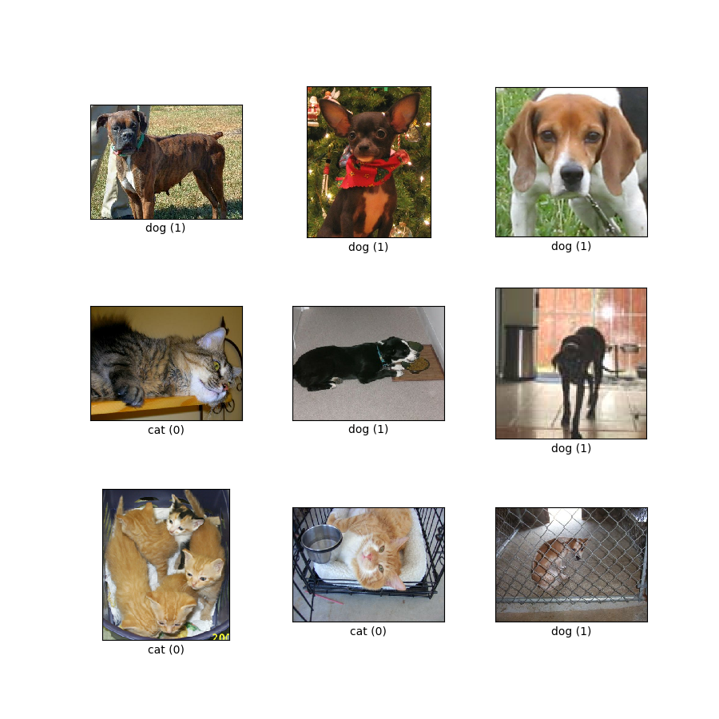

## Google Colab
### Qué es?

[**Google Colab**](https://colab.research.google.com/?hl=es) es una herramienta para escribir y ejecutar código Python en la nube de Google. También es posible incluir texto enriquecido, “links” e imágenes. 

En caso de necesitar altas prestaciones de cómputo, el entorno
permite configurar algunas propiedades del equipo sobre el que se ejecuta el código. En definitiva, el uso de “Google Colab” permite disponer de un entorno para llevar a cabo tareas que serían difíciles de realizar en un equipo personal. 

Por otro lado, siguiendo la idea de “Drive”, “Google Colab” brinda la opción de compartir los códigos realizados, lo que es ideal para trabajos en equipo. 

## Entorno de Trabajo

Para empezar este turorial, lo primero será ir a [**Google Colab**](https://colab.research.google.com/?hl=es) e iniciar un nuevo entorno de trabajo, mejor conocido como *Notebook*, o *Cuaderno* en español.


### Entorno de Ejecución

Ya iniciado un nuevo notebook, deberemos asegurarnos de estar en un entorno de ejecución en el que estemos usando una **GPU** proporcionada por Google Colab. Para esto, seguimos los pasos en las siguientes imagenes.

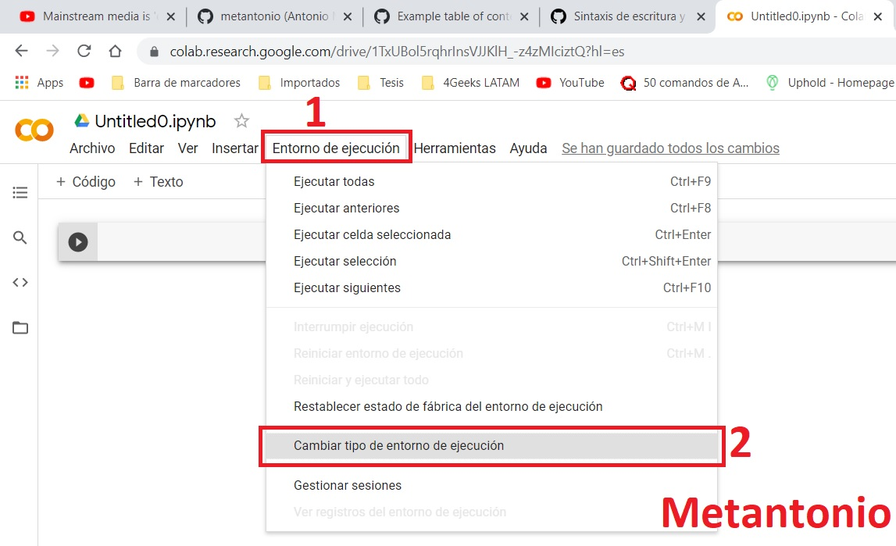


### Importando TensorFlow

A continuación, deberemos importar la librería de TensorFlow para el entrenamiento de redes neuronales y la librería de TensorFlow Datasets para luego poder descargar el dataset de perros y gatos tanto sus datos (imagen), como los metadatos que pueda tener (etiquetas).

```
import tensorflow as tf
import tensorflow_datasets as tfds

##Descargamos ahora el data set de perros y gatos visto en: https://www.tensorflow.org/datasets/catalog/cats_vs_dogs?hl=es-419

datos, metadatos = tfds.load('cats_vs_dogs', as_supervised=True, with_info=True)
```

Le damos *Play* al bloque de código para que se ejecute y esperamos a que termine.

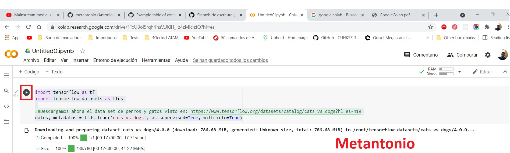

#### Análisis de Metadatos

Opcionalmente, podemos analizar los metadatos del dataset descargado. Para esto podemos agregar un nuevo bloque de código, dándole al botón "+Código", y escribir:

```
metadatos
```
Al hacer esto podemos observar una serie de detalles importantes que vienen encapsulados en formato JSON:

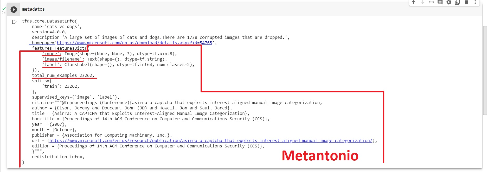

Entre los datos, el único no encapsulado en JSON es `homepage`, el cual en este caso indica que el dataset es de microsoft.

Tenemos `image` el cual para este caso las imagenes del dataset están guardadas en un objeto Image(). También está `image/filename`que nos indica que cada una de las imagenes en el dataset tiene un nombre. Por otra parte está `label` quien nos indica que cada imagen del dataset está etiquetada y con 2 clases distinta, sabemos que 0 para gatos y 1 para perros. Finalmente, pero no menos importante, tenemos `total_num_examples` que en este caso refiere a la cantidad de imagenes que tiene el dataset y son 23262 imagenes.

#### Observación casual del Dataset

La manera más simple de ver algunas imagenes del dataset descargado, es usar el método `.as_dataframe()` que nos proporciona la librería de **TensorFlow Dataset**, donde las imagenes estarán tabuladas por índice, imagen y etiqueta. Para esto, podemos agregar un bloque nuevo de código en nuestro notebook, y para ver 4 imagenes del dataset con sus respectivos metadados, escribimos:

```
tfds.as_dataframe(datos['train'].take(4), metadatos)
```

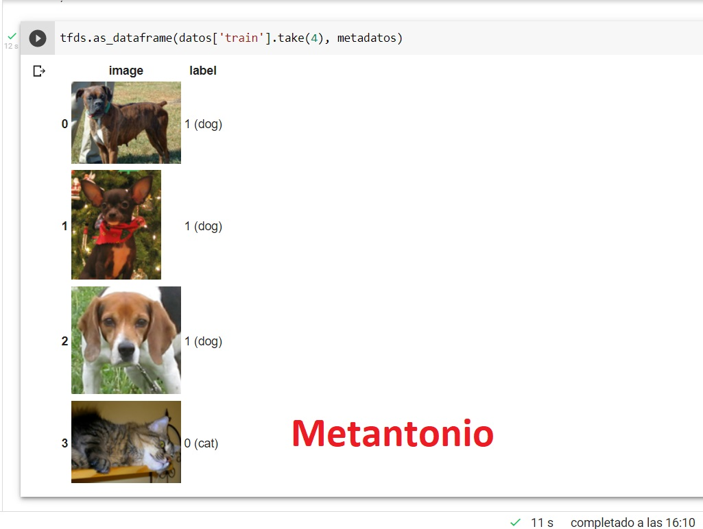

Otra forma, podría ser con el método `.show_examples()`, muestra las imagenes del dataset visualmente mejor, pero se pierde la tabulación de los datos. Usando:

```
tfds.show_examples(datos['train'].take(4), metadatos)
```

#### Observación Total del Dataset

En el mundo de la ciencia de datos y Python, es necesario tener un control total del dataset con el que se está trabajando y la librería más usada en Python para mostrar gráficos, manipularlos, etc... es `matplotlib`. Así que, vamos a importar dicha librería, abrimos un nuevo bloque de código:

```
import matplotlib.pyplot as plt

##La manera más sencilla es recorrer el array de imagenes y mostrar una
for i, (imagen, etiqueta) in enumerate(datos['train'].take(1)):
    plt.imshow(imagen)
```
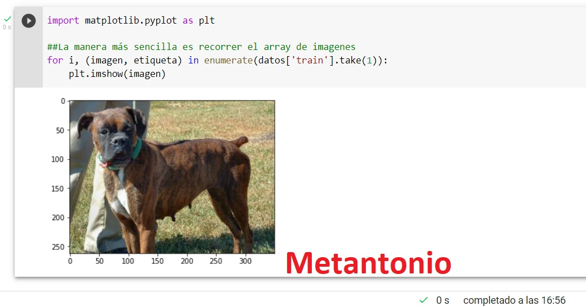

Si se quisieran mostrar dos imagenes no basta con cambiar el argumento `.take(2)`, es necesario subidividir el espacio de ploteo o impresión usando el método `.subplot(filas, columnas, iteración)` de la siguiente manera.

```
import matplotlib.pyplot as plt

##Para mostrar dos imagenes hay que subdividir el espacio de ploteo (Metantonio)
for i, (imagen, etiqueta) in enumerate(datos['train'].take(2)):
    plt.subplot(1, 2, i+1)
    plt.imshow(imagen)
```
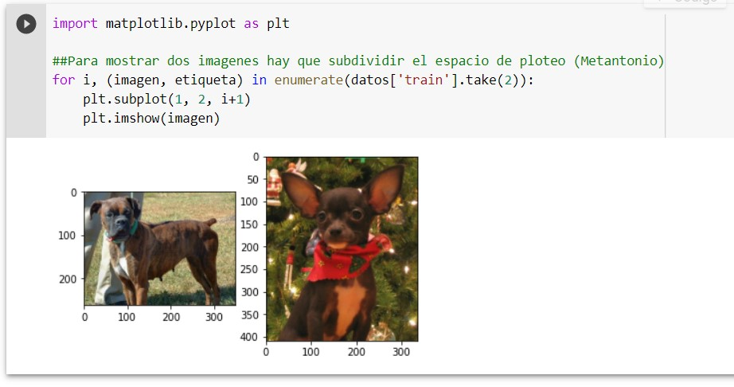

Claro que, empienzan a surgir poblemas cuando queremos mostrar más, ejemplo si mostramos 25 imagenes, en un espacio de 5 filas por 5 columnas:

```
import matplotlib.pyplot as plt

##Para mostrar dos imagenes hay que subdividir el espacio de ploteo (Metantonio)
for i, (imagen, etiqueta) in enumerate(datos['train'].take(25)):
    plt.subplot(5, 5, i+1)
    plt.imshow(imagen)
```
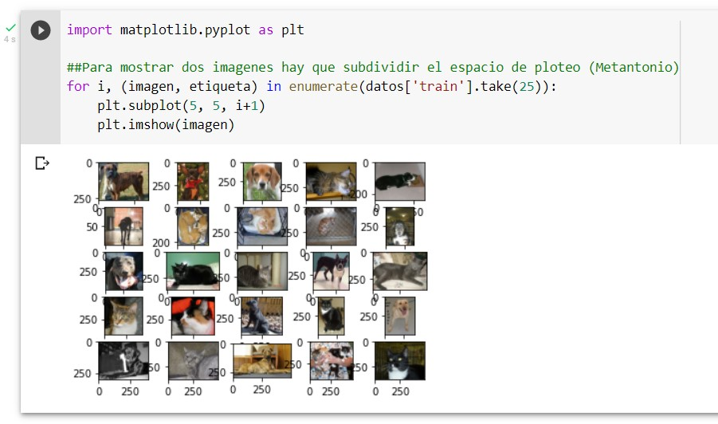

Las imagenes ahora se ven diminutas. Las dividimos en una serie de subespacios, pero por ejemplo, no definimos que tan grande es el espacio sobre el que se están observando. Ese
espacio es el objeto `figure()`, el cual podemos manipular por ensayo y error hasta dar con las dimensiones que queramos:

```
import matplotlib.pyplot as plt

plt.figure(figsize=(20,20))

##Para mostrar dos imagenes hay que subdividir el espacio de ploteo (Metantonio)
for i, (imagen, etiqueta) in enumerate(datos['train'].take(25)):
    plt.subplot(5, 5, i+1)
    plt.imshow(imagen)
```
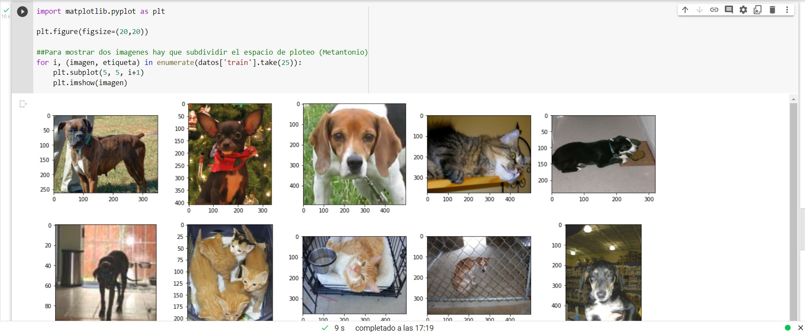

En este caso en particular, no nos interesan las graduaciones de la cantidad de pixeles en el eje X y eje Y de cada imagen. Así que podríamos eliminarlas colocando como arreglo vacío los `.xticks([])` y `.yticks([])`, sólo como ejemplo:

```
import matplotlib.pyplot as plt

plt.figure(figsize=(20,20))

##Para mostrar dos imagenes hay que subdividir el espacio de ploteo (Metantonio)
for i, (imagen, etiqueta) in enumerate(datos['train'].take(25)):
    plt.subplot(5, 5, i+1)
    plt.xticks([])
    plt.yticks([])
    plt.imshow(imagen)
```
### Transformación del Dataset

#### Dimensiones
Al trabajar con una red neuronal para machine learning, la cantidad de neuronas que ésta tenga dependerá de la cantidad de información que le metemos y cómo se la metemos. Como la cantidad de neuronas es siempre fija, lo mejor que podemos hacer es estandarizar los datos de entrada de alguna manera. 

En el caso de las imagenes, la primera idea es redimensionarlas para que todas las imagenes de un dataset tengan las mismas dimensiones, ejemplo 200x200 píxeles.

Es necesario importar la librería `cv2` en Google Colab, aunque si se trabajase en local, se podría con la librería `opencv-python`:

```
import matplotlib.pyplot as plt
import cv2

plt.figure(figsize=(20,20))

TAMANO_IMG=200

##Para mostrar dos imagenes hay que subdividir el espacio de ploteo (Metantonio)
for i, (imagen, etiqueta) in enumerate(datos['train'].take(25)):
    imagen=cv2.resize(imagen.numpy(), (TAMANO_IMG, TAMANO_IMG))
    plt.subplot(5, 5, i+1)
    plt.xticks([])
    plt.yticks([])
    plt.imshow(imagen)
```
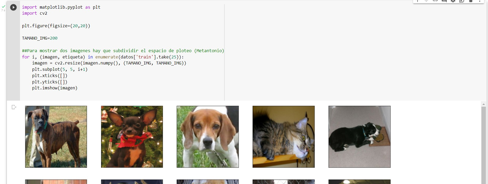

#### Colores

Las imagenes a color no sólo son más pesadas, también son más complicadas de analizar. Lo mejor es disminuir el nivel de complejidad de la red neuronal, ir transformando poco a poco el dataset en algo que le sea más fácil distinguir, como los contornos de las distintas entidades en una imagen, en otras palabras, aumentar el contraste.

Una de las maneras más simples de aumentar el constraste a la vez que eliminamos la complejidad del color, es trabajar las imagenes en blanco y negro o en escala de grises. Por lo que nos vamos aprovechar de la librería cv2 y del método `.cvtColor()`, tal que:

```
import matplotlib.pyplot as plt
import cv2

plt.figure(figsize=(20,20))

TAMANO_IMG=200

##Para mostrar dos imagenes hay que subdividir el espacio de ploteo (Metantonio)
for i, (imagen, etiqueta) in enumerate(datos['train'].take(25)):
    imagen=cv2.resize(imagen.numpy(), (TAMANO_IMG, TAMANO_IMG))
    imagen=cv2.cvtColor(imagen, cv2.COLOR_BGR2GRAY)
    plt.subplot(5, 5, i+1)
    plt.xticks([])
    plt.yticks([])
    plt.imshow(imagen, cmap='gray')
```

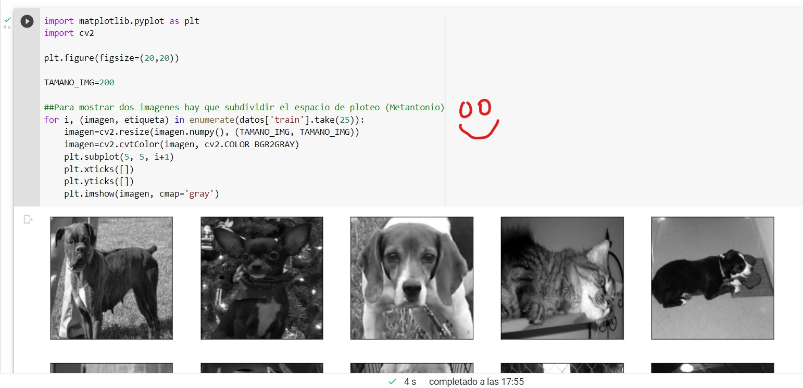

#### Buscando la menor resolución

Es importante reducir la resolución o de las fotos, o aumentarlas, hasta el mínimo punto posible en que nosotros aún podamos distinguir entre perros y gatos en escala de grises. Esto ayuda a la red neuronal a trabajar mejor y más rápido.

Para el ejemplo del tutorial, se dejará la resolución en 100x100 pixeles, tal que:

`TAMANO_IMG=100`

#### Conversión del dataset a TensorFlow

Una vez realizada las transformaciones de todo el dataset, es necesario convertirlo en información numérica que TensorFlow pueda interpretar.

A continuación, creamos una variable del tipo lista para almacenar los datos númericos de cada imagen. Basta con abrir un bloque nuevo de código y escribir:

```
datos_entrenamiento = []
```
Lo que haremos a continuación, será recorrer nuestro dataset de imagenes, aplicarles la transformación a 100x100 pixeles a cada una, especificando que sólo tendrán ahora una (1) escala de color (escala de grises), y agregamos cada una de ellas en la lista recién creada.

```
TAMANO_IMG=100

for i, (imagen, etiqueta) in enumerate(datos['train']):
    imagen=cv2.resize(imagen.numpy(), (TAMANO_IMG, TAMANO_IMG))
    imagen=cv2.cvtColor(imagen, cv2.COLOR_BGR2GRAY)
    imagen= imagen.reshape(TAMANO_IMG, TAMANO_IMG, 1)
    datos_entrenamiento.append([imagen, etiqueta])

```

Podemos imprimir en primer índice para observar cómo están los datos de la primera imagen del dataset.

```
datos_entrenamiento[0]
```


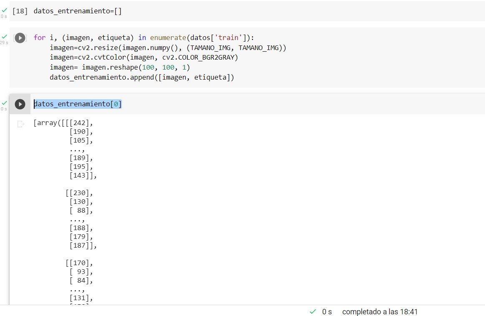


Observamos que, los pixeles de la imagen están ordenados en una escala de color de grises agrupadas por 3 canales (RGB), que pueden ir del valor 0 al 255. Por otro lado, en el array habrá una propiedad llamada `numpy=1`, que implica que la imagen en el índice 0 corresponde a un perro.

Recordar que si queremos conocer la longitud del array, sólo debemos hacer:

```
len(datos_entrenamiento)
```
**Ahora se deben preparar mejor los datos para poderlos entrenar.**

### Preparación del Dataset

Empezaremos por crear dos variables del tipo lista, en la que almacenaramos los pixeles de las imagenes del dataset, y las etiquetas de cada una.

```
X = [] #pixeles de las imagenes de entrada
y = [] #etiquetas (perros=1 y gatos=0)

for imagen, etiqueta in datos_entrenamiento:
    X.append(imagen)
    y.append(etiqueta)
```

A continuación debemos normalizar los valores de los pixeles, de forma que estén entre 0 y 1. Lo podemos hacer con la librería `numpy`, y nos aseguramos que ahora los valores que estaban entre 0 y 255 como enteros, ahora estén entre 0 y 1 como flotantes.

```
import numpy as np

X = np.array(X).astype(float) / 255

#Muestro el valor de los pixeles de la primera imagen
X[0]
```

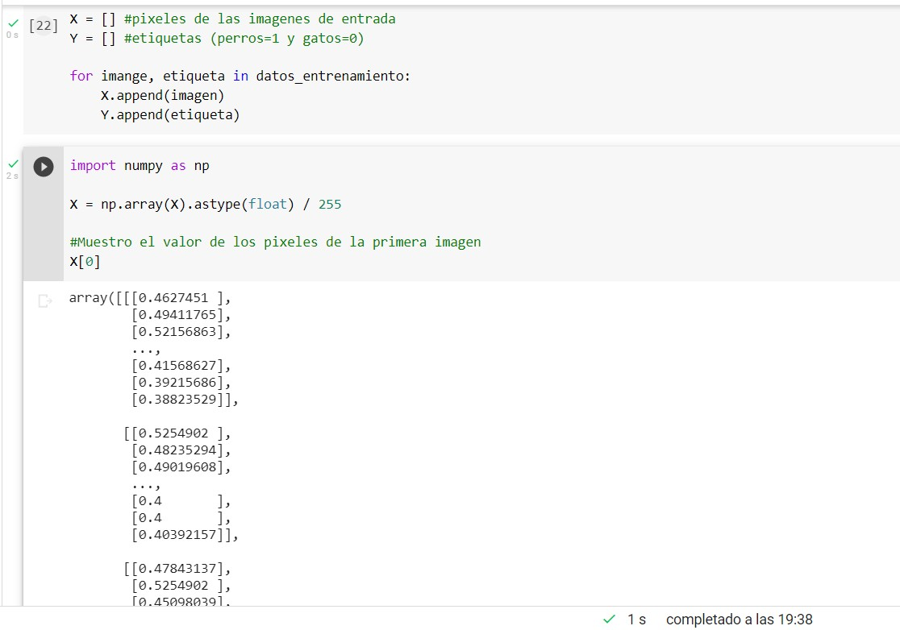

Por otro lado, si imprimimos los valores de `Y`, nos daremos cuenta que están en forma de Tensores. Por lo que debemos reconvertirlos a un formato simple de arreglos comunes y corrientes:

```
y = np.array(y)
```
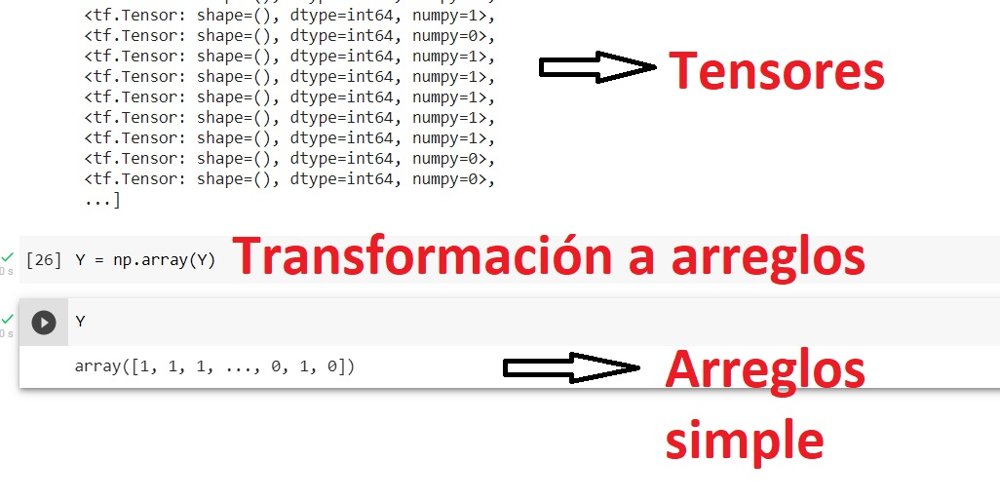

Hacemos una ligera verificación de la información registrada de la variable `X`.

```
X.shape
```
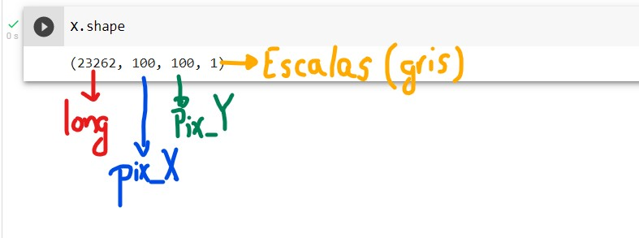
<br/><br/>


## Entrenamiento

En el siguiente punto trataremos 3 modelos distintos de Redes Neuronales. En cada una de estas redes neuronales entrenaremos el dataset ya preparado como está, lo que se conoce como ***entrenamiento sin aumento de datos*** y después modificaremos nuevamente el dataset de una manera muy particular, que se conocerá como ***entrenamiento con aumento de datos***.

### Entrenamiento sin aumento de Datos

#### Red Neuronal Densa

En una red densa, cada neurona de la capa está conectada con todas las neuronas de la siguiente capa. En la siguiente imagen podemos ver la representación gráfica de una red neuronal artificial.

<p align="center">
    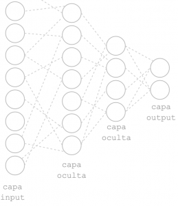
</p>

Para aplicar una red neuronal densa con la librería de TensorFlow, aplicamos los componenente de modelos predefinidos **KERAS**, los cuales podemos armar como legos. Por ejemplo, para hacer una red densa con una capa de entrada, dos capas ocultas con 150 neuronas cada una que servirán para analizar los 10.000 pixeles (100x100) y el contraste de los bordes por la escala de grises, y una capa de salida de 1 neurona que nos dirá si la imagen es perro o gato, debemos hacer lo siguiente:

```
#Sigmoid regresa siempre datos entre 0 y 1. Realizamos el entrenamiento para al final considerar que si la respuesta se
#acerca a 0, es un gato, y si se acerca a 1, es un perro.

modeloDenso = tf.keras.models.Sequential([
  tf.keras.layers.Flatten(input_shape=(100, 100, 1)),
  tf.keras.layers.Dense(150, activation='relu'),
  tf.keras.layers.Dense(150, activation='relu'),
  tf.keras.layers.Dense(1, activation='sigmoid')
])
```
<p align="center">
    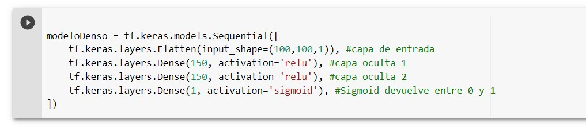
</p>

#### Red Neuronal Convolucional
Las redes neuronales convolucionales consisten en múltiples capas de filtros convolucionales de una o más dimensiones. Después de cada capa, por lo general se añade una función para realizar un mapeo causal no-lineal.

Como redes de clasificación, al principio se encuentra la fase de extracción de características, compuesta de neuronas convolucionales y de reducción de muestreo. Al final de la red se encuentran neuronas de perceptron sencillas para realizar la clasificación final sobre las características extraídas. La fase de extracción de características se asemeja al proceso estimulante en las células de la corteza visual. Esta fase se compone de capas alternas de neuronas convolucionales y neuronas de reducción de muestreo. Según progresan los datos a lo largo de esta fase, se disminuye su dimensionalidad, siendo las neuronas en capas lejanas mucho menos sensibles a perturbaciones en los datos de entrada, pero al mismo tiempo siendo estas activadas por características cada vez más complejas.

```
#La capa de entrada tiene 32 filtros, luego un proceso
#de MaxPooling en el que una submatriz de 2x2 recorre la 
#imagen y saca un promedio del valor de los pixeles, es una
#manera de aprender de los objetos más que de los contornos.

modeloCNN = tf.keras.models.Sequential([
  tf.keras.layers.Conv2D(32, (3,3), activation='relu', input_shape=(100, 100, 1)),
  tf.keras.layers.MaxPooling2D(2, 2),
  tf.keras.layers.Conv2D(64, (3,3), activation='relu'),
  tf.keras.layers.MaxPooling2D(2, 2),
  tf.keras.layers.Conv2D(128, (3,3), activation='relu'),
  tf.keras.layers.MaxPooling2D(2, 2),

  tf.keras.layers.Flatten(),
  tf.keras.layers.Dense(100, activation='relu'),
  tf.keras.layers.Dense(1, activation='sigmoid')
])
```

<p align="center">
    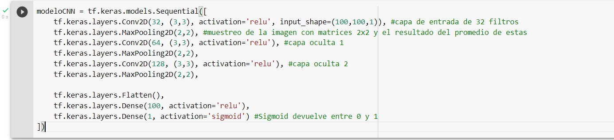
</p>

#### Red Neuronal Convolucional Dropout
Es exactamente igual a la red neuronal convolucional con la diferencia en que existe una probabilidad que durante alguna de las iteraciones algunas neuronas de las capas ocultas se desactiven, obligando a la red neuronal a usar otras neuronas. Es recomendable que la capa densa tenga cerca del doble de neuronas o más de lo que tendría la red sin el DropOut.

```
#El DropOut es del 50%, por esa razón necesita el doble, o más, de neuronas

modeloCNN2 = tf.keras.models.Sequential([
  tf.keras.layers.Conv2D(32, (3,3), activation='relu', input_shape=(100, 100, 1)),
  tf.keras.layers.MaxPooling2D(2, 2),
  tf.keras.layers.Conv2D(64, (3,3), activation='relu'),
  tf.keras.layers.MaxPooling2D(2, 2),
  tf.keras.layers.Conv2D(128, (3,3), activation='relu'),
  tf.keras.layers.MaxPooling2D(2, 2),

  tf.keras.layers.Dropout(0.5),
  tf.keras.layers.Flatten(),
  tf.keras.layers.Dense(250, activation='relu'),
  tf.keras.layers.Dense(1, activation='sigmoid')
])
```

<p align="center">
    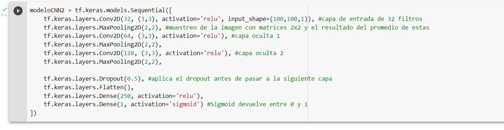
</p>

### Compilación de los Modelos

Compilaremos los modelos que tenemos hasta ahora, con el optimizador [`adam`](https://keras.io/api/optimizers/adam/), el cual funciona con descenso del gradiente estimando derivadas de primer y segundo orden, de forma que:

```
#binary_crossentropy es la función de pérdida para resultados binarios

modeloDenso.compile(optimizer='adam', 
    loss='binary_crossentropy', 
    metrics=['accuracy']
    )

modeloCNN.compile(optimizer='adam', 
    loss='binary_crossentropy',
    metrics=['accuracy']
    )

modeloCNN2.compile(optimizer='adam', 
    loss='binary_crossentropy',
    metrics=['accuracy']
    )
```
<p align="center">
    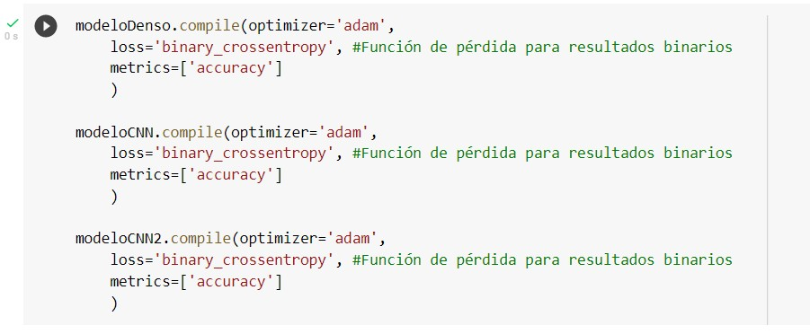
</p>

### Visualización de los Modelos

Para la visualización gráfica de los modelos, vamos a importar `TensorBoard`, de la siguiente manera:

```
from tensorflow.keras.callbacks import TensorBoard
```

### Empezar entrenamiento

Primero crearemos una variable para almacenar los resultados de cada iteración de la red neuronal y poderlos visualizar en una gráfica, esto se hace para cada modelo de red neuronal:

```
tensorboardDenso = TensorBoard(log_dir='logs/denso') #guarda los resultados de la red densa en la carpeta denso
```

Entrenamos el modelo con el método `.fit()`

```
modeloDenso.fit(X, y, batch_size=32,
                validation_split=0.15,
                epochs=100,
                callbacks=[tensorboardDenso])
```
<p align="center">
    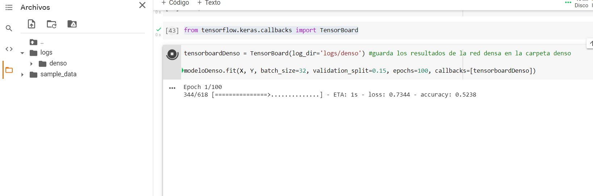
</p>

Si todo sale correctamente, en Google Colab se pueden observar los datos con Tensor Board, para esto cargamos TensorBoard usando el siguiente comando interno de Colab (no es Python), y le indicamos la carpeta a cargar los datos:

```
%load_ext tensorboard
```
```
%tensorboard --logdir logs
```
En esta sección es importante analizar la función de pérdida de la red neuronal al aprender, y la función de pérdida de la red al evaluar ese 15% de datos de validación, esto es lo que garantizará que la red neuronal realmente funcione en el mundo real. (Si en el momento de ejecutar tensorboard no se está usando GPU, no abrirán los gráficos). 

***Lo ideal es que la función de pérdida de los aprendido por las redes neuronales tienda a 0, y que la función de pérdida en la evaluación de los datos de validación también tiendan a 0.***

<p align="center">
    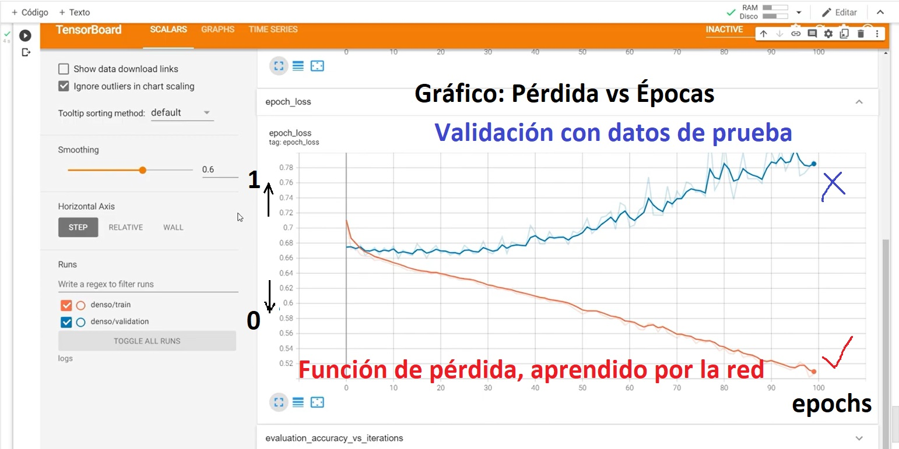
</p>

Como se aprecia en la imagen anterior, aunque la red es buena para memorizar los datos de entrenanimiento, al usar lo aprendido para evaluar los datos de validación, la función de pérdida aumenta, estoy implica que para este problema en específico de clasificar perros y gatos en imagenes, este tipo de Red Neuronal Densa no es buena en el mundo real. A este problema se le conoce como **Sobre-ajuste**.

Llegados a este punto, sólo nos quedan por entrenar las dos redes convolucionales, tal que:

```
#Modelo Convolucional

tensorboardCNN = TensorBoard(log_dir='logs/cnn')
modeloCNN.fit(X, y, batch_size=32,
                validation_split=0.15,
                epochs=100,
                callbacks=[tensorboardCNN])
```
```
#Modelo Convolucional con Dropout

tensorboardCNN2 = TensorBoard(log_dir='logs/cnn2')
modeloCNN2.fit(X, y, batch_size=32,
                validation_split=0.15,
                epochs=100,
                callbacks=[tensorboardCNN2])
```

Recargando la vista en el TensordBoard ya abierto, y eliminando las escalas, observamos que:

<p align="center">
    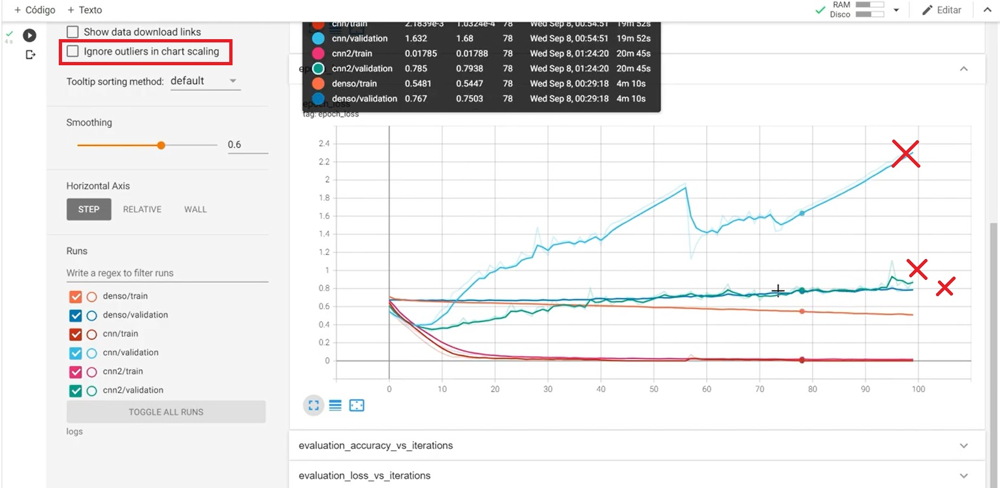
</p>

Las 3 funciones de pérdida de las validaciones de datos aumentan, esto quiere decir que los 3 modelos de redes neuronales sin aumento de datos, están sufriendo de **sobre-ajuste**, en otras palabras, no pueden generalizar lo aprendido para usarlo en el mundo real.

En base a esto, se desarrollaron técnicas para la manipulación del dataset ya existente, de forma que la red sea capaz de generalizar los resultados. Pero antes de esto vamos a gestionar la memoria RAM de Google Colab.

### Gestión de RAM

Cuando la memoria RAM esté al máximo en Google Colab, es necesario limpiarla o se puede cerrar la sesión por haber alcanzado el límite, para limpiarla se hace lo siguiente:

```
import gc
gc.collect()
```
### Entrenamiento con aumento de Datos

El aumento de datos, como su nombre parece sugerir, es una técnica en la que se manipula el dataset de imagenes de forma que se manipulen y/o deformen las mismas sin perder el sentido sobre lo que se muestra. Esto significa, deformar la imagen de perros y gatos pero que aún se noten que siguen siendo perros y gatos.

Primero veamos el dataset que teníamos sin aplicar el aumento de datos todavía:

```
#ver las imagenes de la variable X sin modificaciones por aumento de datos
plt.figure(figsize=(20, 8))
for i in range(10):
  plt.subplot(2, 5, i+1)
  plt.xticks([])
  plt.yticks([])
  plt.imshow(X[i].reshape(100, 100), cmap="gray")
```

<p align="center">
    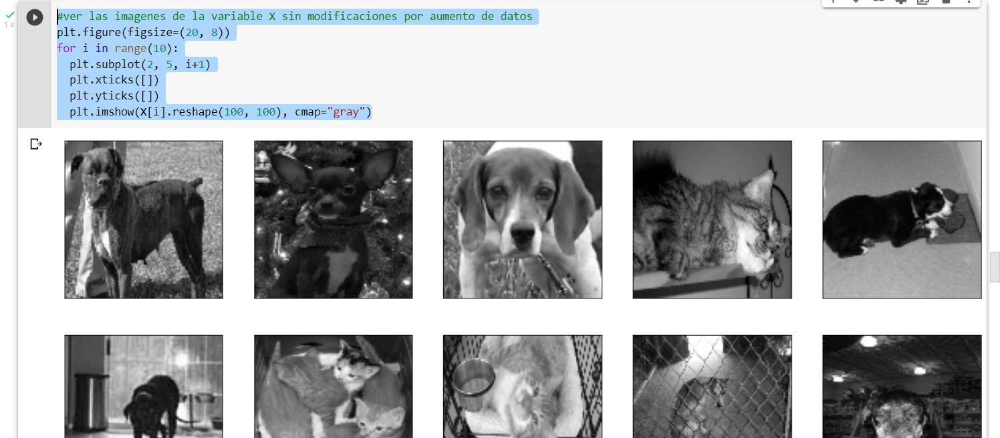
</p>

A continuación, importamos una librería de keras, `ImageDataGenerator`, que nos permite manipular las imagenes para el aumento de datos:

```
from tensorflow.keras.preprocessing.image import ImageDataGenerator
```
Antes de aplicar el código, veamos algunas propiedades para cambiar la forma de las imagenes:

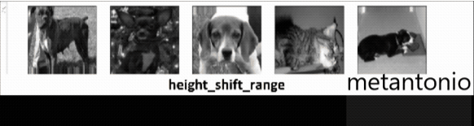

```
#Realizar el aumento de datos con varias transformaciones. Al final, graficar 10 como ejemplo
from tensorflow.keras.preprocessing.image import ImageDataGenerator

datagen = ImageDataGenerator(
    rotation_range=30,
    width_shift_range=0.2,
    height_shift_range=0.2,
    shear_range=15,
    zoom_range=[0.7, 1.4],
    horizontal_flip=True,
    vertical_flip=True
)

datagen.fit(X)

plt.figure(figsize=(20,8))

#el batch_size al ser de 10, hace que en la primera
#iteracion se muestren las 10 imagenes. Por lo tanto,
#solo hay 1 iteracion en el for-loop más externo

for imagen, etiqueta in datagen.flow(X, y, batch_size=10, shuffle=False):
  for i in range(10):
    plt.subplot(2, 5, i+1)
    plt.xticks([])
    plt.yticks([])
    plt.imshow(imagen[i].reshape(100, 100), cmap="gray")
  break
```

#### Red Neuronal Densa AD

Definimos la red densa aumentada:

```
modeloDenso_AD = tf.keras.models.Sequential([
  tf.keras.layers.Flatten(input_shape=(100, 100, 1)),
  tf.keras.layers.Dense(150, activation='relu'),
  tf.keras.layers.Dense(150, activation='relu'),
  tf.keras.layers.Dense(1, activation='sigmoid')
])
```
#### Red Neuronal Convolucional AD

```
modeloCNN_AD = tf.keras.models.Sequential([
  tf.keras.layers.Conv2D(32, (3,3), activation='relu', input_shape=(100, 100, 1)),
  tf.keras.layers.MaxPooling2D(2, 2),
  tf.keras.layers.Conv2D(64, (3,3), activation='relu'),
  tf.keras.layers.MaxPooling2D(2, 2),
  tf.keras.layers.Conv2D(128, (3,3), activation='relu'),
  tf.keras.layers.MaxPooling2D(2, 2),

  tf.keras.layers.Flatten(),
  tf.keras.layers.Dense(100, activation='relu'),
  tf.keras.layers.Dense(1, activation='sigmoid')
])
```
#### Red Neuronal Convolucional Dropout AD

```
modeloCNN2_AD = tf.keras.models.Sequential([
  tf.keras.layers.Conv2D(32, (3,3), activation='relu', input_shape=(100, 100, 1)),
  tf.keras.layers.MaxPooling2D(2, 2),
  tf.keras.layers.Conv2D(64, (3,3), activation='relu'),
  tf.keras.layers.MaxPooling2D(2, 2),
  tf.keras.layers.Conv2D(128, (3,3), activation='relu'),
  tf.keras.layers.MaxPooling2D(2, 2),

  tf.keras.layers.Dropout(0.5),
  tf.keras.layers.Flatten(),
  tf.keras.layers.Dense(250, activation='relu'),
  tf.keras.layers.Dense(1, activation='sigmoid')
])
```
### Compilación de los Modelos AD
```
modeloDenso_AD.compile(optimizer='adam',
                    loss='binary_crossentropy',
                    metrics=['accuracy'])

modeloCNN_AD.compile(optimizer='adam',
                    loss='binary_crossentropy',
                    metrics=['accuracy'])

modeloCNN2_AD.compile(optimizer='adam',
                    loss='binary_crossentropy',
                    metrics=['accuracy'])
```


### Empezar entrenamiento AD

Como hemos generado data nueva en el dataset, debemos separar manualmente los datos de validación de los datos que usaremos de entrenamiento, por lo que crearemos variables nuevas `X_entrenamiento` y `X_validación`, de igual manera con las etiquetas, `y_entrenamiento` y `y_validación`.

```
#Separar los datos de entrenamiento y los datos de pruebas en variables diferentes

len(X) * .85 #19700
len(X) - 19700 #3562

X_entrenamiento = X[:19700]
X_validacion = X[19700:]

y_entrenamiento = y[:19700]
y_validacion = y[19700:]
```

```
#Usar la funcion flow del generador para crear un iterador que podamos enviar como entrenamiento a la funcion FIT del modelo

data_gen_entrenamiento = datagen.flow(X_entrenamiento, y_entrenamiento, batch_size=32)
```
Ahora empezamos con el entrenamiento.

Para la red densa:

```
tensorboardDenso_AD = TensorBoard(log_dir='logs/denso_AD')

modeloDenso_AD.fit(
    data_gen_entrenamiento,
    epochs=100, batch_size=32,
    validation_data=(X_validacion, y_validacion),
    steps_per_epoch=int(np.ceil(len(X_entrenamiento) / float(32))),
    validation_steps=int(np.ceil(len(X_validacion) / float(32))),
    callbacks=[tensorboardDenso_AD]
)
```

Para la red convolucional:
```
tensorboardCNN_AD = TensorBoard(log_dir='logs-new/cnn_AD')

modeloCNN_AD.fit(
    data_gen_entrenamiento,
    epochs=150, batch_size=32,
    validation_data=(X_validacion, y_validacion),
    steps_per_epoch=int(np.ceil(len(X_entrenamiento) / float(32))),
    validation_steps=int(np.ceil(len(X_validacion) / float(32))),
    callbacks=[tensorboardCNN_AD]
)
```

Para la red convolucional con dropout:
```
tensorboardCNN2_AD = TensorBoard(log_dir='logs/cnn2_AD')

modeloCNN2_AD.fit(
    data_gen_entrenamiento,
    epochs=100, batch_size=32,
    validation_data=(X_validacion, y_validacion),
    steps_per_epoch=int(np.ceil(len(X_entrenamiento) / float(32))),
    validation_steps=int(np.ceil(len(X_validacion) / float(32))),
    callbacks=[tensorboardCNN2_AD]
)
```

***En este punto debemos analizar gráficamente qué sucede con cada modelo de aprendizaje, ver si sufre de sobre-ajuste, y elegir el que más nos conviene.***

## Selección del Modelo y Exportación

Si has analizado los modelos, probablemente llegaste a la conclusión de que entre los 6 modelos evaluados, el de **la red convolucional con datos aumentados** es aquella con mejor comportamiento.

Si te perdiste, echa un vistazo rápido a la siguiente imagen, en la que se muestran los gráficos de precisión entre el entrenamiento y datos de validación, y el gráfico de la función de pérdida entre los datos de entrenamiento y los de validación, para **la red convolucional con datos aumentados** .


<p align="center">
    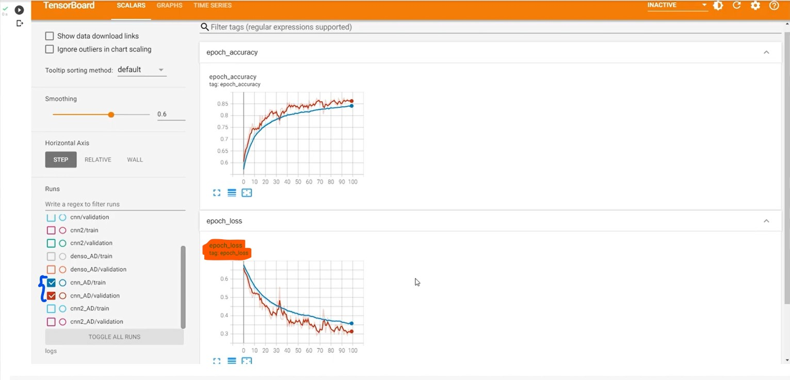
</p>


Elegido el modelo, sólo tienes que entrenarlo por más épocas para que se vuelva más preciso. Por ejemplo, 1000 épocas, o **hasta que la pérdida sea igual o menor a 0,02 (equivale al 2% de error) u otro nivel de precisión según se necesite.**

Ya con nuestro modelo bien entrenado, lo primero será guardarlo y colocarle un nombre, usando el método `.save()`. Los modelos se guardan en formato `.h5`:

```
modeloCNN_AD.save('perros-gatos-cnn-ad.h5')
```
***Entre los datos guardados por el método .save(), el más importante es acerca de los pesos de cada neurona y la conexión entre éstas que no es más que el orden en que se multiplican las matrices contenedoras de los pesos***

A continuación, como queremos exportarlo a un formato JSON, será necesario instalar tensorflowjs con pip:

```
!pip install tensorflowjs
```

Creamos una carpeta, llamada `carpeta_salida`, para guardar el modelo a convertir:

```
!mkdir carpeta_salida
```

Finalmente, usaremos el convertidor de tensorflowjs para convertir nuestro modelo:

```
!tensorflowjs_converter --input_format keras perros-gatos-cnn-ad.h5 carpeta_salida
```
Y se generarán archivos `.bin` y `model.json` en la carpeta de salida, los cuales debemos descargar para poder usar la red en una página web en tiempo real.

<p align="center">
    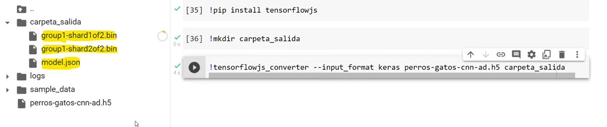
</p>

## Creación Página Web

<!-- Sección de Referencias -->
<br/>
<br/>

## Referencias

[- Redes Neuronales Convolucionales para clasificación por color, bordes y texturas en imagenes con Python.](https://brax.gg/deep-learning-with-tensor-flow-and-keras-cats-and-dogs/)

[- TensorFLow.](https://www.tensorflow.org/?hl=es-419)

[- Ringa-Tech.](https://github.com/ringa-tech)    